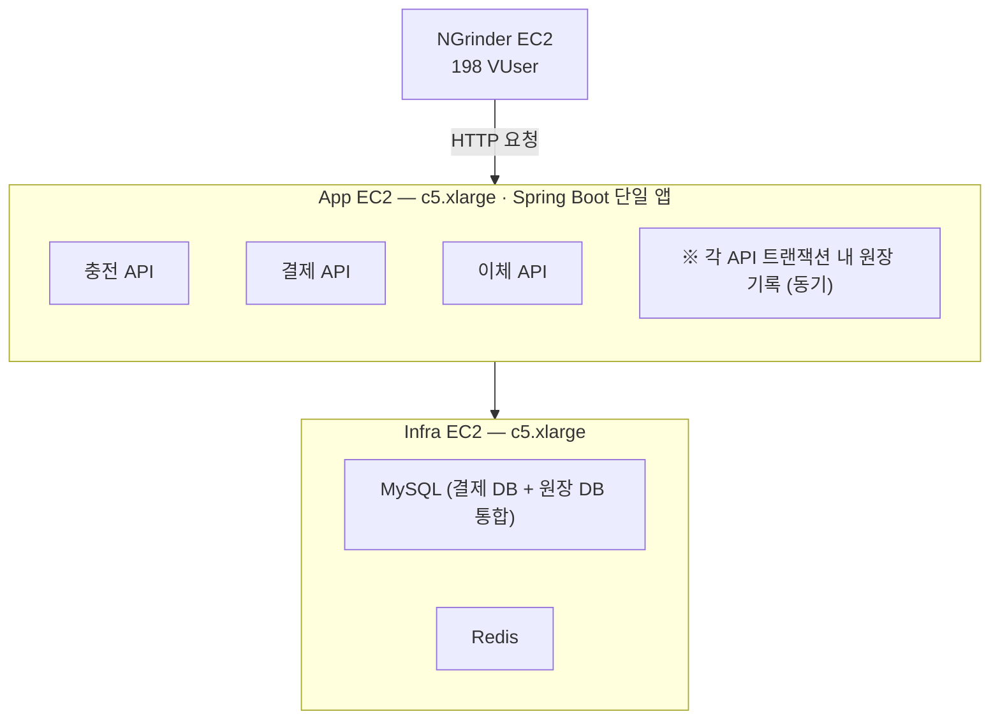
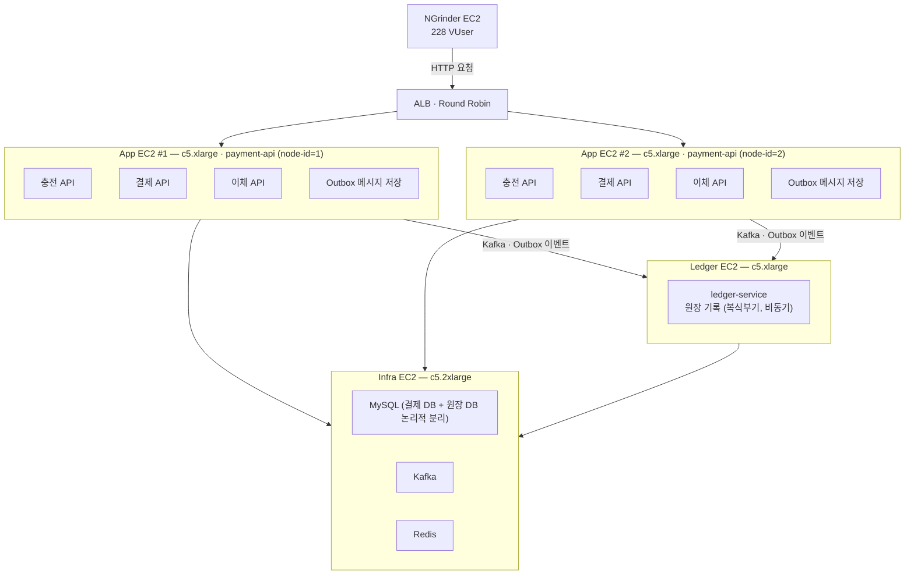

# JPay - 선불 충전형 간편 결제 서비스

정합성이 중요한 시스템을 직접 설계하고 검증해보기 위해 만든 개인 프로젝트입니다.

도메인 선정은 결제 서비스로 선택했으며, 데이터 정합성이 실제 금전 손실로 직결되는 도메인이라 기술적 도전이 명확하다고 생각했습니다. 내부적으로 충전·결제·송금을 처리하는 결제 도메인과, 모든 금전 흐름을 복식부기로 기록하는 원장 도메인으로 구성되며, 결제 도메인에서 발생한 이벤트는 Kafka를 통해 원장 도메인으로 비동기 전달됩니다.

1,000 TPS의 부하 상황에서 데이터를 정확하고 안정적으로 처리할 수 있는 시스템을 만드는 것이 목표였습니다. 모놀리식으로 구현한 이후 부하 테스트를 통해 결제 도메인의 독립적인 확장 필요성을 확인했고 MSA로 전환했습니다. 결과적으로 약 750 TPS에서 1,000 TPS를 처리할 수 있었습니다.

---

## 기술 스택

Java 21 / Spring Boot 3.5 / Spring Data JPA / Apache Kafka 3.9 / Redis 7 / MySQL 8.0

---

## 아키텍처

### Before — 모놀리식



결제 처리량이 병목에 도달했을 때 payment-api만 독립적으로 확장할 수 없었습니다. MSA로 전환하면서 트래픽이 집중되는 payment-api만 독립적으로 수평 확장 가능하도록 구조를 개선했습니다. 단일 인스턴스 TPS 상한 ~760 실측.

### After — MSA



트래픽이 집중되는 payment-api를 2대로 독립적으로 수평 확장하고, 원장 기록을 Kafka 비동기로 분리해 결제 응답 경로에서 제거했습니다. TPS 1,007 달성.

---

## API

| Method | Endpoint | 설명 |
|--------|----------|------|
| POST | `/charges` | 은행 계좌에서 선불 잔액을 충전합니다 |
| POST | `/payments/pessimistic` | 선불 잔액을 차감해 가맹점에 결제합니다 |
| POST | `/transfers` | 선불 잔액을 다른 사용자에게 송금합니다 |

---

## 모듈 구조

```
apps/
  payment-api        충전·결제·이체 API, Outbox 발행
  ledger-service     Kafka 소비 → 복식부기 원장 기록
  charge-recovery    PENDING 충전 복구 스케줄러

libs/
  common-core        Money VO, Snowflake ID 생성기
  common-event       이벤트 DTO (payment-api ↔ ledger-service 계약)
  common-idempotency Redis 기반 멱등성 AOP
  common-jpa         JPA 공통 설정, SnowflakeId 하이버네이트 생성기
  common-web         전역 예외 핸들러, 에러 타입
```

MSA 전환을 고려해 단일 저장소 내에서도 서비스 경계를 모듈 단위로 명확히 분리한 모듈러 모놀리식 구조를 채택했습니다.

---

## 핵심 설계 결정

### 1. 복식부기 원장 — 정합성 수치 검증

선불 결제 서비스에서는 충전·결제·송금이 발생할 때마다 "돈이 어디서 왔고 어디로 갔는가"를 추적할 수 있어야 한다고 생각했습니다. 이 기록을 원장(Ledger)이라 하며, 결제 도메인에서 원장의 정합성을 지키는 것은 곧 금전 오류가 발생하지 않는다는 것을 의미하므로 매우 중요합니다.

단순히 거래 금액만 기록하는 단식부기 방식은 오류가 발생했을 때 어느 지점에서 정합성이 깨졌는지 추적하기 어렵습니다. 복식부기는 모든 금전 흐름을 차변(Debit)과 대변(Credit) 양쪽에 동시에 기록합니다. 차변은 자산의 증가 또는 부채의 감소를, 대변은 자산의 감소 또는 부채의 증가를 나타냅니다. 거래가 올바르게 기록됐다면 반드시 `SUM(DEBIT) = SUM(CREDIT)`이 성립하므로, 이 등식 하나로 수백만 건의 정합성을 수치로 검증할 수 있습니다.

예를 들어 사용자가 10,000원을 충전하면, 회사 입장에서는 은행으로부터 현금이 들어왔으므로 자산(OPERATING_CASH)이 증가해 차변에 +10,000원을 기록합니다. 동시에 사용자에게 나중에 결제로 돌려줘야 하는 부채(USER_MONEY)가 생겼으므로 대변에 +10,000원을 기록합니다. 두 항목의 합이 항상 일치하므로, 어느 한쪽이 누락되거나 금액이 틀리면 즉시 감지됩니다.

**도메인 구조**

도메인은 `Account`와 `LedgerEntry` 두 엔티티로 구성됩니다. `Account`는 `USER_MONEY`(사용자 선불 잔액), `OPERATING_CASH`(회사 운영 자금) 같은 계정 유형과 소유자 식별자를 갖습니다. 사용자마다 `USER_MONEY` 계정이 하나씩 존재하고, 회사 계정은 시스템 전체에서 하나입니다.

`LedgerTransaction`은 비즈니스 이벤트 한 건(충전·결제·송금)을 대표하는 상위 엔티티입니다. 거래 유형, 총 금액, 외부 식별자(`externalId`)를 갖고, 멱등성 보장을 위해 `externalId`에 UNIQUE 제약을 겁니다.

`LedgerEntry`는 `LedgerTransaction` 하나에 속하는 행 단위 기록입니다. 충전 한 건이 발생하면 `OPERATING_CASH` 계정에 차변 항목, `USER_MONEY` 계정에 대변 항목, 이렇게 두 개의 `LedgerEntry`가 하나의 `LedgerTransaction` 아래 생성됩니다.

`LedgerTransaction`과 `LedgerEntry` 모두 append-only로 설계했습니다. 한 번 INSERT된 레코드는 수정하지 않으며, 오류 수정이 필요한 경우에도 반대 방향의 역분개(reversal entry)를 새로 INSERT해 모든 이력이 보존됩니다.

### 2. Saga (Choreography) — 분산 트랜잭션 처리

MSA 구조에서는 서비스마다 DB가 분리되어 있어 단일 트랜잭션으로 여러 서비스의 데이터를 원자적으로 처리할 수 없습니다. 어느 한 서비스에서 실패가 발생했을 때 이미 커밋된 다른 서비스의 데이터를 어떻게 보정할지가 핵심 문제입니다.

2PC는 참여 서비스가 모두 잠금을 유지해야 하므로 가용성이 낮아집니다. Saga 패턴은 각 서비스가 로컬 트랜잭션만 커밋하고 이벤트로 다음 단계를 트리거하는 방식으로, 서비스 간 잠금 없이 독립적으로 처리할 수 있습니다. 그 중 각 서비스가 이벤트를 발행·구독하며 스스로 반응하는 Choreography 방식을 선택했습니다.

**충전 흐름**은 외부 은행 API 호출이 포함되어 세 단계로 나뉩니다. 충전 요청을 PENDING 상태로 저장한 뒤, 은행 API를 호출해 실제 출금이 발생하는 순간이 Pivot입니다. 이 지점을 넘으면 외부 자금 이동이 발생했으므로 되돌릴 수 없습니다. 은행 호출 성공 이후 COMPLETED 전환과 Outbox 저장은 멱등하게 재시도할 수 있습니다.

**충전 흐름 Saga 단계 분류:**

| 단계 | 작업 | 분류 |
|------|------|------|
| 1 | PENDING 저장 | Compensatable (FAILED로 롤백 가능) |
| 2 | 은행 API 호출 | **Pivot** (출금 발생 — 되돌릴 수 없는 지점) |
| 3 | COMPLETED + Outbox 저장 | Retriable (멱등하게 재시도 가능) |

**결제 흐름**은 외부 API 호출 없이 잔액 차감, Payment INSERT, Outbox INSERT가 하나의 `@Transactional`에 묶입니다. 단일 커밋이므로 Compensatable 단계 없이 전부 성공하거나 전부 실패합니다. 커밋 이후 Outbox 발행과 원장 기록은 Retriable입니다.

**결제 흐름 Saga 단계 분류:**

| 단계 | 작업 | 분류 |
|------|------|------|
| 1 | 잔액 차감 + Payment INSERT + Outbox INSERT | **Pivot** (단일 `@Transactional` — Compensatable 없음, 커밋 이후 Retriable) |

### 3. Outbox 패턴 — 원장 이벤트 유실 방지

Saga에서 각 서비스는 이벤트를 발행해 다음 단계를 트리거합니다. 그런데 DB 저장과 Kafka 발행은 하나의 트랜잭션으로 묶을 수 없어 이벤트 유실이 발생할 수 있습니다. 예를 들어, DB 커밋 직후 서버가 죽으면 원장 이벤트가 발행되지 않고, 반대로 Kafka에 먼저 발행하면 DB 롤백 시 원장에 유령 거래가 생깁니다.

따라서 Outbox 패턴을 적용하여 이벤트를 결제·충전과 **같은 트랜잭션**에 DB에 저장하고, 별도 스케줄러가 폴링 방식으로 읽어 Kafka에 발행합니다. DB 커밋이 곧 원장 이벤트 발행 보장입니다.

```
@Transactional
public Payment deductPessimisticAndComplete(...) {
    userBalanceTxService.deductWithPessimisticLock(userId, amount);
    Payment payment = Payment.completed(...);
    paymentRepository.save(payment);
    outboxEventRepository.save(buildOutboxEvent(payment));  // 같은 트랜잭션
    return payment;
}
```

### 4. 멱등성 처리 — 이중 결제 방지

결제 도메인에서 동일 요청이 중복 처리되면 데이터 정합성이 틀어지고, 비즈니스에 심각한 피해를 초래할 수 있습니다. API 차원에서는 네트워크 재전송이나 클라이언트 재시도로 동일 요청이 중복 도달할 수 있습니다. 원장에 내역을 기록하는 ledger-service는 Kafka의 at-least-once 특성으로 인해 동일 이벤트가 중복 도달할 수 있습니다. 따라서 시스템 전반의 멱등한 처리가 중요합니다.

**API 멱등성**

`@Idempotent` AOP로 구현했습니다. 클라이언트가 요청 헤더에 `Idempotency-Key`를 포함하면, AOP가 Redis에서 해당 키의 캐시 응답을 먼저 조회합니다. 캐시가 있으면 실제 로직 없이 즉시 반환하고, 없으면 처리 후 결과를 Redis에 저장합니다(TTL 24시간). Redis 조회와 저장 사이에 두 요청이 동시에 통과하는 경우는 DB의 `external_id` UNIQUE 제약이 `DataIntegrityViolationException`으로 차단합니다.

```java
// ChargeController.java
@Idempotent
@PostMapping
@ResponseStatus(HttpStatus.CREATED)
public ChargeResponse charge(
        @RequestHeader("Idempotency-Key") String idempotencyKey,
        @RequestHeader("X-User-Id") Long userId,
        @Valid @RequestBody ChargeRequest request) {
    return chargeFacadeService.charge(idempotencyKey, userId, request);
}
```

```java
// IdempotencyAspect.java
Optional<String> cached = idempotencyStore.load(idempotencyKey);
if (cached.isPresent()) {
    return objectMapper.readValue(cached.get(), returnType);  // 캐시 응답 반환
}
Object result = pjp.proceed();
idempotencyStore.save(idempotencyKey, objectMapper.writeValueAsString(result), ttl);
```

**Kafka Consumer 멱등성**

ledger-service의 Kafka consumer는 `LedgerTransaction`의 `external_id` UNIQUE 제약으로 중복 이벤트를 방지합니다. 첫 번째 이벤트가 처리된 이후 동일 이벤트가 재전달되면 `LedgerService.record()`의 `existsByExternalId` 선행 조회에서 걸러 early return합니다. 두 이벤트가 동시에 도달해 선행 조회를 함께 통과한 경우는 UNIQUE 제약이 `DataIntegrityViolationException`을 발생시키며 catch-and-skip으로 처리합니다.

```java
// LedgerService.java
if (ledgerTransactionRepository.existsByExternalId(externalId)) {
    log.info("Event already processed: {}", externalId);
    return;
}

// AbstractLedgerEventConsumer.java
try {
    process(event);
} catch (DataIntegrityViolationException e) {
    log.warn("Duplicate event skipped (concurrent race): entityId={}", extractEntityId(event));
}
```

### 5. 송금 API 데드락 방지

송금은 송금자의 잔액을 차감하고 수신자의 잔액을 증가시키는 방식으로 두 사용자의 잔액 행을 동시에 수정합니다. 잔액 정합성을 위해 비관적 락을 사용하는데, A→B, B→A 요청이 동시에 들어오면 각자 자신의 잔액 락을 먼저 잡고 상대방 잔액 락을 기다리다 데드락에 빠질 수 있습니다. 따라서 데드락 발생 조건인 순환 대기를 무효화하는 것이 중요하다고 생각했고, **항상 낮은 userId 순으로 락을 획득**하도록 강제해 두 요청이 동일한 순서로 잠금을 시도하게 만들어 데드락을 원천 방지하도록 했습니다.

```java
// TransferService.java
Long firstId  = Math.min(fromUserId, request.toUserId());
Long secondId = Math.max(fromUserId, request.toUserId());

UserBalance first  = userBalanceRepository.findByUserIdForUpdate(firstId)   // 항상 작은 id 먼저 락
        .orElseThrow(...);
UserBalance second = userBalanceRepository.findByUserIdForUpdate(secondId)
        .orElseThrow(...);

UserBalance sender   = firstId.equals(fromUserId) ? first : second;
UserBalance receiver = sender == first ? second : first;
```

```java
// TransferServiceDeadlockTest.java
@Test
@DisplayName("A→B, B→A 교차 송금 동시 실행 시 데드락 없이 완료")
void crossTransfer_noDeadlock() throws InterruptedException {
    int threadCount = 100;
    CountDownLatch startLatch = new CountDownLatch(1);
    CountDownLatch doneLatch  = new CountDownLatch(threadCount);
    AtomicInteger successCount = new AtomicInteger();

    for (int i = 0; i < threadCount / 2; i++) {
        executorService.submit(() -> {
            try {
                startLatch.await();
                transferService.transfer(USER_A, new TransferRequest(USER_B, TRANSFER_AMOUNT));
                successCount.incrementAndGet();
            } catch (Exception ignored) {
            } finally {
                doneLatch.countDown();
            }
        });
        executorService.submit(() -> {
            try {
                startLatch.await();
                transferService.transfer(USER_B, new TransferRequest(USER_A, TRANSFER_AMOUNT));
                successCount.incrementAndGet();
            } catch (Exception ignored) {
            } finally {
                doneLatch.countDown();
            }
        });
    }

    startLatch.countDown();
    boolean completed = doneLatch.await(10, TimeUnit.SECONDS);  // 10초 내 미완료 = 데드락
    executorService.shutdown();

    assertThat(completed).as("데드락 발생 — 10초 내 완료되지 않음").isTrue();
    assertThat(successCount.get()).isEqualTo(threadCount);

    long balanceA = userBalanceRepository.findByUserId(USER_A).orElseThrow().getBalance().amount();
    long balanceB = userBalanceRepository.findByUserId(USER_B).orElseThrow().getBalance().amount();
    assertThat(balanceA).isEqualTo(INITIAL_BALANCE);  // 송금 후 총 잔액 보존
    assertThat(balanceB).isEqualTo(INITIAL_BALANCE);
}
```

### 6. 충전 흐름 — Circuit Breaker

충전은 외부 은행 API를 동기로 호출해야 합니다. 은행 API에 지연이나 장애가 발생하면 Tomcat 스레드가 응답을 기다리며 점유 상태가 되고, 장애가 지속되면 스레드 풀이 소진되어 정상 결제 요청까지 처리하지 못하는 연쇄 장애로 이어질 수 있습니다. 따라서 은행 API 장애를 빠르게 감지하고 불필요한 스레드 대기를 제거하는 것이 중요합니다.

Resilience4j Circuit Breaker를 적용해 최근 20회 호출 중 실패율이 50%를 초과하거나 5초 이상의 느린 호출이 70%를 넘으면 CB를 OPEN합니다. OPEN 상태에서는 은행 API를 호출하지 않고 즉시 실패 응답을 반환하므로 Tomcat 스레드가 대기 없이 해제됩니다. CB OPEN 또는 은행 API 오류가 발생하면, PENDING으로 저장한 충전 요청은 FAILED로 전환하는 보상 트랜잭션을 실행합니다.

은행 API 호출에는 `@Retry`와 `@CircuitBreaker`를 함께 적용했는데, 이때 Retry가 CB 바깥 레이어가 됩니다. CB OPEN 시 즉시 `BankCircuitOpenException`을 던지는데, 이를 `ignore-exceptions`에 등록하지 않으면 Retry가 의미 없는 재시도를 반복합니다. `ignore-exceptions`에 등록해 CB OPEN 상태에서는 재시도를 건너뛰고 즉시 실패 처리합니다.

```yaml
resilience4j:
  circuitbreaker:
    instances:
      bankTransfer:
        sliding-window-size: 20
        failure-rate-threshold: 50       # 최근 20회 중 50% 초과 실패 시 OPEN
        slow-call-rate-threshold: 70     # 느린 호출 비율 70% 초과 시 OPEN
        slow-call-duration-threshold: 5s
        wait-duration-in-open-state: 30s
  retry:
    instances:
      bankTransfer:
        max-attempts: 3
        wait-duration: 100ms
        enable-exponential-backoff: true
        ignore-exceptions:
          - juyeop.jpay.payment.bank.BankCircuitOpenException  # CB OPEN 시 재시도 제외
```

### 7. PENDING 충전 복구 스케줄러

충전 API에서 은행 API 호출(Pivot 지점)이 성공한 직후 서버가 다운되는 상황을 생각해볼 수 있습니다. 사용자의 실제 은행 계좌에서는 이미 현금 출금이 발생했지만, DB에는 충전 내역이 PENDING인 상태로 남아 서비스 내의 선불 잔액(UserBalance)이 충전되지 않습니다. 돈은 빠져나갔는데 충전이 안 된 상황으로, 사용자 입장에서는 심각한 불편이고 원장 정합성도 깨집니다.

이를 보완하기 위해 3분 이상 PENDING 상태인 충전 건을 감지해 은행 API를 재조회하고 상태를 충전 완료로 전환하고 잔액에 금액을 반영하는 복구 스케줄러를 별도로 구성했습니다.

3분 기준은 정상 처리 중인 충전이 완료되기에 충분한 여유 시간을 두고 설정한 러프한 기준입니다.

고수준의 데이터 정합성을 유지하려면 정상 흐름뿐 아니라 예외 상황까지 설계 범위에 포함해야 한다는 것을 실감할 수 있었습니다.

---

## 부하 테스트 결과

시나리오: 충전 30% / 결제 60% / 이체 10%, 랜덤 userId 500만 풀  
환경: AWS EC2 (ap-northeast-2), NGrinder 부하 생성기

### 모놀리식 (단일 인스턴스)

| 지표 | 값 |
|------|----|
| VUser | 198 |
| TPS | **757.8** |
| Mean Test Time | 250ms |
| Error rate | 0% |
| Executed Tests | 671,549건 |
| App CPU | 77.6% |

병목: bank mock `Thread.sleep(200~500ms)`이 Tomcat 스레드를 점유했습니다. 단일 인스턴스 TPS 상한 ~760을 확인했습니다.

### MSA (payment-api 2대 + 원장 비동기)

| 지표 | 값 |
|------|----|
| VUser | 228 |
| TPS | **1,007.1** |
| Mean Test Time | 215ms |
| Error rate | 0% |
| Executed Tests | 884,505건 |
| App #1 CPU | 76% |
| App #2 CPU | 63% |

payment-api 2대 수평 확장 + 원장 비동기(Kafka)로 **+33% TPS 향상**을 달성했습니다.

### 정합성 검증

부하 테스트 후 실행된 모든 건수에 대해 아래 항목을 SQL로 직접 검증했습니다. 모든 항목이 통과했습니다.

| CHECK | 검증 내용 | 기대값 |
|-------|-----------|--------|
| CHECK_1 | `user_balance.balance < 0` 건수 — 잔액 음수 발생 여부 (동시성 제어 실패 지표) | 0 |
| CHECK_2a | payment_db 완료 상태의 결제 건수 = ledger_db 기록된 원장 건수 | 일치 |
| CHECK_2b | payment_db 완료 상태의 충전 건수 = ledger_db 기록된 원장 건수 | 일치 |
| CHECK_3 | 거래별 `SUM(DEBIT) ≠ SUM(CREDIT)` 건수 — 복식부기 불균형 | 0 |
| CHECK_4 | `outbox_events.published = false` 잔존 건수 — Outbox 이벤트 미발행 여부 | 0 |
| CHECK_5a | payment_db 결제 금액 합계 = ledger_db 원장 DEBIT 합계 | 일치 |
| CHECK_5b | payment_db 충전 금액 합계 = ledger_db 원장 CREDIT 합계 | 일치 |

---

## 로컬 실행

```bash
# 인프라 기동 (MySQL × 4, Kafka, Redis, Prometheus, Grafana, Zipkin, Pact Broker)
docker compose up -d

# payment-api
./gradlew :apps:payment-api:bootRun

# ledger-service
./gradlew :apps:ledger-service:bootRun

# charge-recovery (선택)
./gradlew :apps:charge-recovery:bootRun
```

**인프라 구성**

| 컨테이너 | 포트 | 용도 |
|---------|------|------|
| jpay-mysql-payment | 3307 | payment_db |
| jpay-mysql-ledger | 3308 | ledger_db |
| jpay-kafka | 9092 | KRaft 모드 (Zookeeper 불필요) |
| jpay-redis | 6379 | 멱등성 키, 분산 락 |
| jpay-prometheus | 9090 | 메트릭 수집 |
| jpay-grafana | 3000 | 대시보드 |
| jpay-zipkin | 9411 | 분산 트레이싱 |
| jpay-pact-broker | 9292 | 계약 테스트 브로커 |

**모니터링**

| UI | URL |
|----|-----|
| Grafana | http://localhost:3000 (admin / admin) |
| Prometheus | http://localhost:9090 |
| Zipkin | http://localhost:9411 |
| Pact Broker | http://localhost:9292 (pact / pact) |

---

## 테스트 실행

통합 테스트는 MySQL, Redis, Kafka, Pact Broker 컨테이너가 필요합니다. `docker compose up -d` 후 실행해야 합니다.

```bash
./gradlew :apps:payment-api:test
./gradlew :apps:ledger-service:test
```
